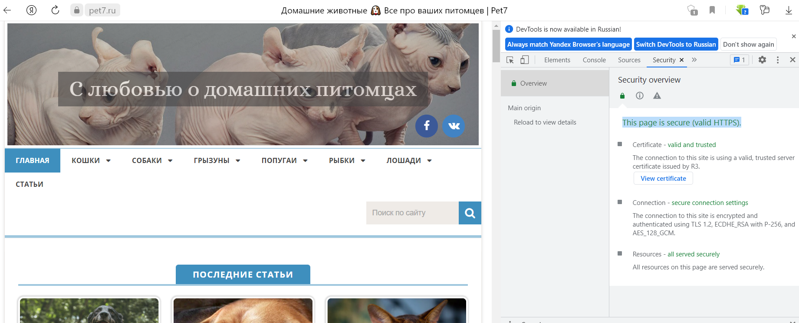
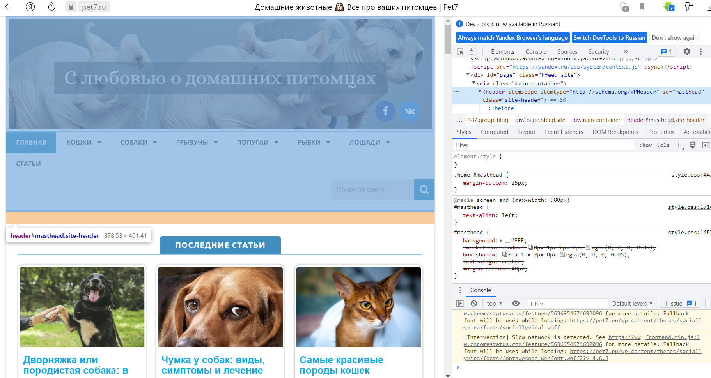
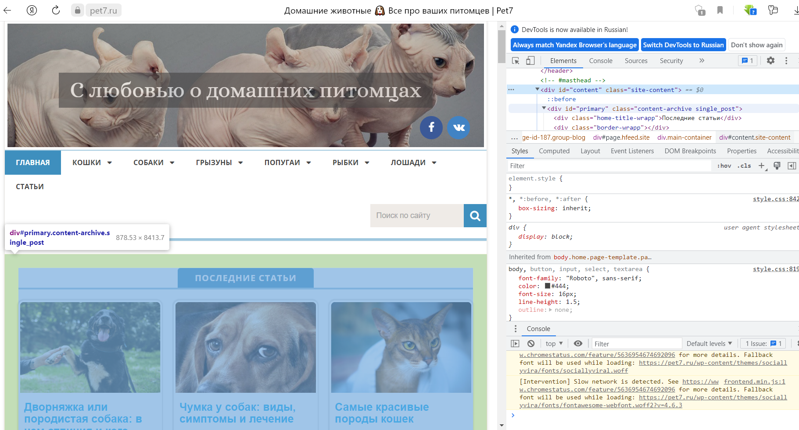
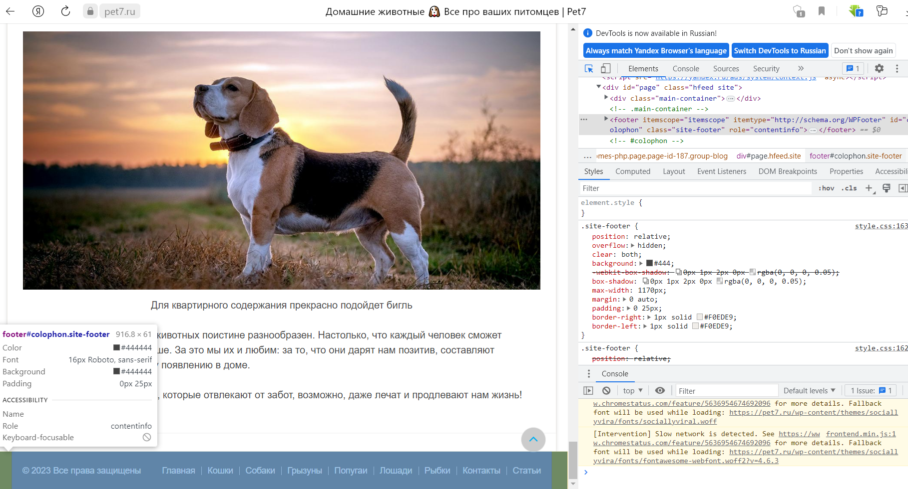
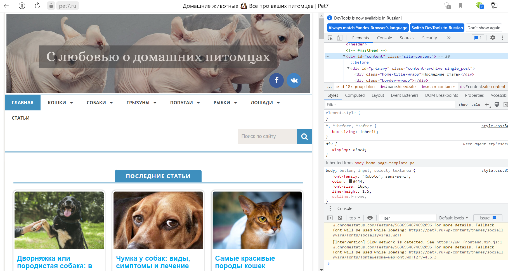
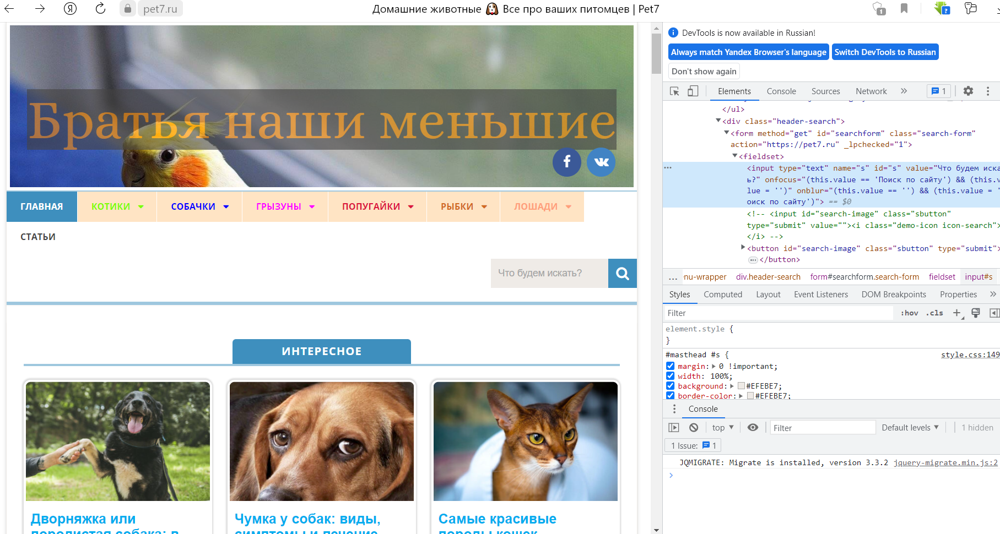
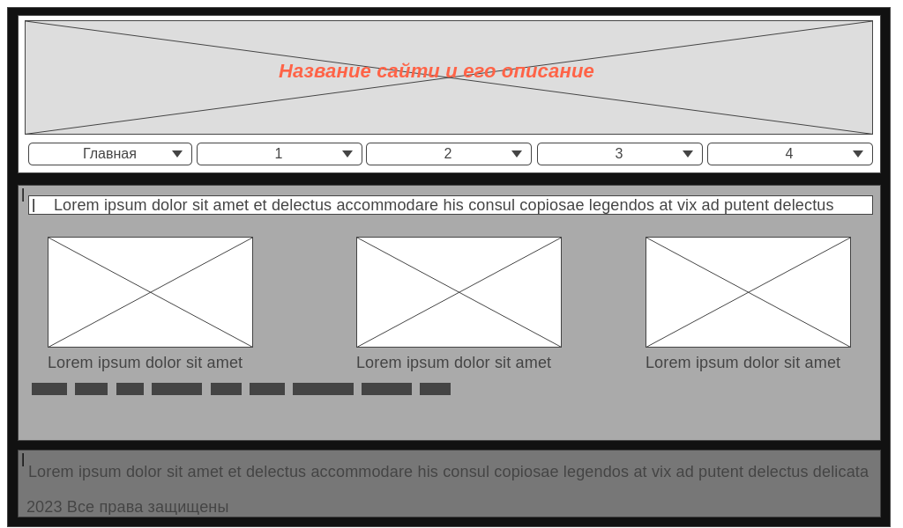

# Задача: на основе сайта https://pet7.ru/
- Определите, на каком протоколе работает сайт.
- Проанализируйте структуру страницы сайта.
- Внесите не менее 3 изменений на страницу с помощью инструмента разработчика и представьте скриншоты было/стало.
- Создайте прототип низкой детализации.

# Решение

1. Протокол HTTPS

2. Header

3. Main content

4. Footer

5. Было до изменений

6. Стало после изменений

7. Протокол низкой детализации
